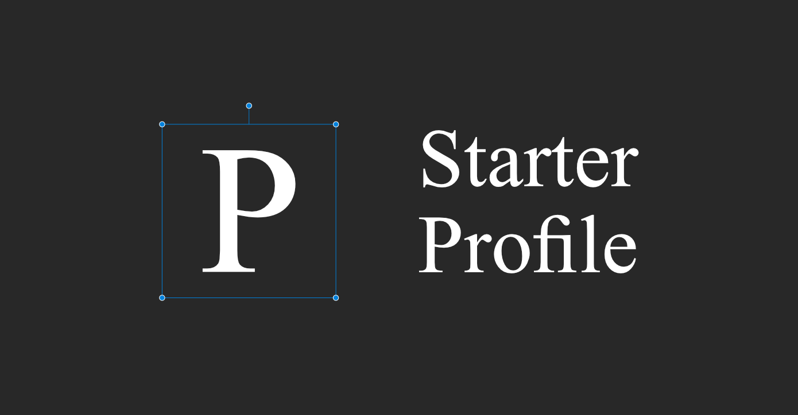

# Penpot Starter Profile

This plugin allows you to generate information to use as placeholder in your designs.

You can generate things like:

- First names
- Usernames
- Countries
- Dates

# Install on Penpot

Open the plugins modal in your Penpot project and add the next url

- https://starter-profile-plugin.netlify.app/manifest.json

Click install and you're setup! you can start generating placeholder data for your designs
